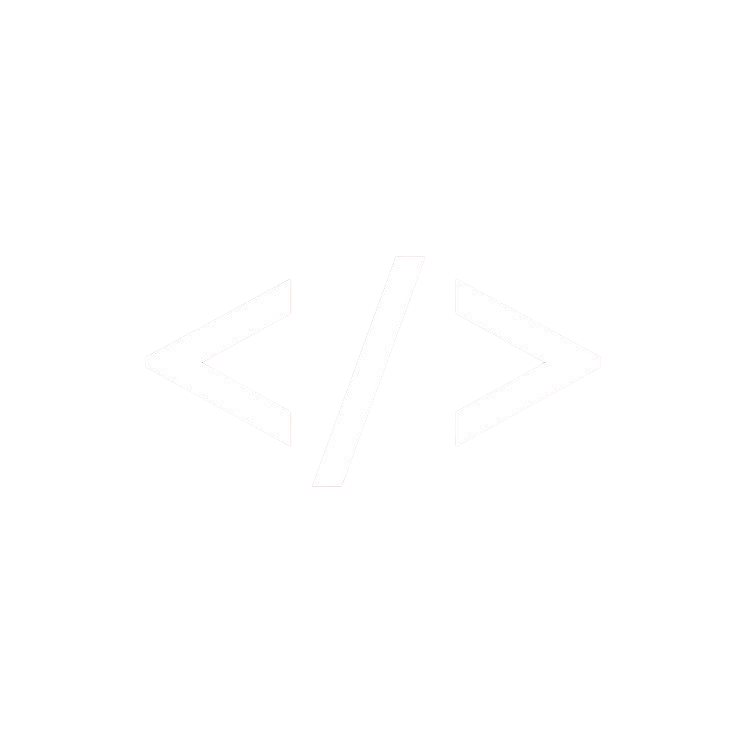

# John Rey F. Billones - Portfolio

Personal portfolio built with Next.js and Tailwind CSS, showcasing experience, projects, and technical skills.

## Live Site

- https://johnreybillones.vercel.app/

## Screenshot



## Core Stack

- Next.js 15
- TypeScript
- Tailwind CSS
- EmailJS
- PWA support via `@ducanh2912/next-pwa`
- reCAPTCHA v3
- Lucide and React Icons

## Resume-Aligned Content

The portfolio content is aligned to the latest resume details and profile updates, including:

- Profile and contact information
- Experience and organization background
- Projects
- Skills
- Education

## Local Development

1. Clone the repository

```bash
git clone https://github.com/johnreybillones/Portfolio.git
cd Portfolio
```

2. Install dependencies

```bash
pnpm install
```

3. Start development server

```bash
pnpm dev
```

4. Open

- http://localhost:3000

## Environment Variables

Create `.env.local` with:

```env
NEXT_PUBLIC_EMAILJS_SERVICE_ID=
NEXT_PUBLIC_EMAILJS_TEMPLATE_ID=
NEXT_PUBLIC_EMAILJS_PUBLIC_KEY=
```

## Contact

- Email: bjf0073@dlsud.edu.ph
- LinkedIn: https://www.linkedin.com/in/johnreybillones
- GitHub: https://github.com/johnreybillones
- Facebook: https://www.facebook.com/jrbillonesss/
